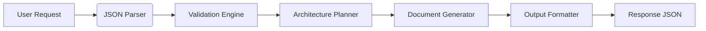

# Architecture Integration Plan

## 1. Features Overview
- **Core Functionality**: Agent-based code editing system with JSON command interface
- **Validation System**: Strict input validation for JSON commands and SAFE_PATHS
- **Documentation Handling**: Focused markdown documentation generation
- **Safety Mechanisms**: Path sanitization and write restrictions
- **Cross-Cutting Concerns**:
  - Error Handling (atomic writes/full content requirement)
  - Security Enforcement (path validation)
  - Quality Assurance (automated checks)

## 2. Interfaces and Contracts
### Input Interface
```json
{
  "files": [
    {
      "path": "relative/path/to/file.ext",
      "content": "full content without partial updates"
    }
  ]
}
```
**Contracts**:
- `path` must be relative and match SAFE_PATHS patterns
- `content` must contain complete file content (no partial updates)
- All paths validated against allowlist patterns

### Output Interface
```json
{
  "files": [
    {
      "path": "docs/dev/ARCHITECTURE_INTEGRATION_PLAN.md",
      "content": "..."
    }
  ]
}
```
**Contracts**:
- Only modifies files in SAFE_PATHS
- Returns full file content
- Maintains atomic write operations

## 3. Data Flow


## 4. Architectural Decision Records (ADRs)
### ADR-001: Strict File-Based Operations
**Status**: Approved
**Context**: Need to prevent partial modifications and ensure atomic writes
**Decision**:
- Require complete file content in all operations
- Prohibit patch/diff formats
**Consequences**:
+ Eliminates merge conflicts
+ Simplifies version control
- Larger payload sizes

### ADR-002: Path Validation Layer
**Status**: Approved
**Context**: Critical security requirement for file system access
**Decision**:
- Implement SAFE_PATHS allowlist
- Reject absolute paths and parent directory traversal
**Consequences**:
+ Prevents unauthorized access
- Requires strict path pattern validation

### ADR-003: Incremental Integration Strategy
**Status**: Proposed
**Context**: Need phased rollout with zero regression risk
**Decision**:
- Phase-based implementation with validation gates
- Automated contract verification at each phase
**Consequences**:
+ Reduces integration risks
+ Enables continuous validation

## 5. Incremental Integration Plan
### Phase 1: Foundation
- [ ] Implement JSON command parser
- [ ] Build SAFE_PATHS validation module
- [ ] Create markdown template engine
- [ ] Setup monitoring for core operations

### Phase 2: Core Functionality
- [ ] Integrate architecture planning logic
- [ ] Connect validation to documentation generator
- [ ] Implement output formatting
- [ ] Add dead-letter handling for invalid requests

### Phase 3: Validation & QA
- [ ] Integrate ruff/mypy static checks
- [ ] Implement pytest test suite
- [ ] Establish git pre-commit hooks
- [ ] Achieve 90%+ test coverage

### Phase 4: Productionization
- [ ] Error handling for invalid requests
- [ ] Logging for audit trails
- [ ] Performance benchmarking
- [ ] Blue/green deployment validation

## Risk Mitigation
- **Path Injection**: Sanitize all input paths using SAFE_PATHS
- **Data Loss**: Require full file content in all operations
- **Integration Failures**: Automated contract verification
- **Quality Regressions**: Enforce QA gates (ruff/mypy/pytest)

## QA Safeguards
- All changes require:
  - `ruff check` passing
  - `mypy --strict` compliance
  - 90%+ pytest coverage
- Git branch protection:
  - 2 approvals minimum
  - Status checks mandatory
  - SAFE_PATHS validation in CI pipeline
