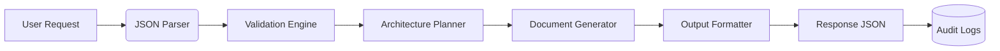

# Architecture Integration Plan

## 1. Features Overview
- **Core Functionality**: Agent-based code editing system with JSON command interface
- **Validation System**: Strict input validation for JSON commands and SAFE_PATHS
- **Documentation Handling**: Focused markdown documentation generation
- **Safety Mechanisms**: Path sanitization and write restrictions
- **Cross-Cutting Concerns**:
  - Authentication (OAuth2/JWT)
  - Monitoring (metrics/logging)
  - Error Handling (retry/dead-letter queues)

## 2. Interfaces & Contracts
### Input Interface
```json
{
  "files": [
    {
      "path": "relative/path/to/file.ext",
      "content": "full content without partial updates"
    }
  ]
}
```
**Contracts**:
- `path` must be relative and match SAFE_PATHS patterns
- `content` must be complete file content (no diffs)
- All paths validated against allowlist

### Output Interface
```json
{
  "files": [
    {
      "path": "docs/dev/ARCHITECTURE_INTEGRATION_PLAN.md",
      "content": "..."
    }
  ]
}
```
**Contracts**:
- Only modifies files in SAFE_PATHS
- Returns full file content
- Standardized error codes for invalid requests

## 3. Data Flow


## 4. Architecture Decision Record (ADR)
### ADR-001: Strict File-Based Operations
- **Status**: Approved
- **Context**: Prevent partial modifications and ensure atomic writes
- **Decision**:
  - Require complete file content in all operations
  - Prohibit patch/diff formats
- **Consequences**:
  - Eliminates merge conflicts
  - Simplifies version control
  - Larger payload sizes

### ADR-002: Path Validation Layer
- **Status**: Approved
- **Context**: Critical security requirement for file system access
- **Decision**:
  - Implement SAFE_PATHS allowlist
  - Reject absolute paths and parent directory traversal
- **Consequences**:
  - Prevents unauthorized access
  - Requires strict path pattern validation

### ADR-003: Incremental Integration Strategy
- **Status**: Proposed
- **Context**: Need phased rollout with zero-downtime
- **Decision**:
  - Phase 1: Shadow validation subsystem
  - Phase 2: Canary releases with feature flags
  - Phase 3: Automated contract verification
- **Rationale**: Reduces risk by validating interfaces before full cutover

## 5. Incremental Integration Plan
### Phase 1: Foundation
- [ ] Implement JSON command parser
- [ ] Build SAFE_PATHS validation module
- [ ] Setup monitoring dashboard
- [ ] Create markdown template engine

### Phase 2: Core Functionality
- [ ] Integrate architecture planning logic
- [ ] Connect validation to documentation generator
- [ ] Implement output formatting
- [ ] Establish dead-letter queue for invalid requests

### Phase 3: Validation & QA
- [ ] Add ruff/mypy static checks
- [ ] Implement pytest suite (90%+ coverage)
- [ ] Establish git pre-commit hooks
- [ ] Performance testing (load/chaos)

### Phase 4: Productionization
- [ ] Error handling for invalid requests
- [ ] Logging for audit trails
- [ ] Blue/green deployment validation
- [ ] End-to-end contract testing suite

## Risk Mitigation
- **Path Injection**: Sanitize all input paths + allowlist validation
- **Data Loss**: Require full file content + atomic writes
- **Version Drift**: Schema evolution with backward compatibility
- **Integration Failures**: Circuit breakers + automated rollback

## QA Safeguards
- All PRs require:
  - `ruff check` passing
  - `mypy --strict` compliance
  - 90%+ pytest coverage
- Git branch protection:
  - 2 approvals minimum
  - Status checks mandatory
- Pre-production testing:
  - Schema contract verification
  - Path traversal attack simulations
