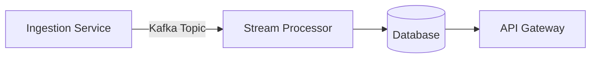

# Architecture Integration Plan

## 1. Features
- **Feature A**: Description fonctionnelle et critères d'acceptance
- **Feature B**: Capacités principales avec contraintes techniques
- **Feature C**: Exigences de performance et de sécurité

## 2. Interfaces
### Module X ↔ Module Y
- **Contract**: Protobuf schema v3 (x_to_y.proto)
- **Protocol**: gRPC unary calls
- **Error Handling**: Retry policy (exponential backoff)

### Service Z API
- **Endpoint**: POST /v1/process
- **Input**: JSON payload with mandatory {id, timestamp}
- **Output**: Standard envelope {status, data, error}

## 3. Dataflows

- **Critical Path**: Validation → Enrichment → Persistence
- **Data Formats**: Avro for streaming, JSON for REST APIs

## 4. ADR
### ADR-001: Event-Driven Core
- **Status**: Accepted
- **Context**: Need for decoupled processing
- **Decision**: Kafka-based event bus with exactly-once semantics
- **Consequences**: +Scalability -Operational complexity

## 5. Incremental Integration Plan
### Phase 1: Foundation
1. Implement core messaging infrastructure
2. Deploy monitoring (Prometheus/Grafana)

### Phase 2: Vertical Integration
1. Integrate Feature A with mock dependencies
2. End-to-end testing with contract validation

### Phase 3: Horizontal Scale
1. Add load balancing for critical services
2. Implement circuit breakers

### Phase 4: Optimization
1. Introduce caching layer
2. Performance tuning

## Risk Mitigation
- **Contract Drift**: Schema registry enforcement
- **Data Loss**: Idempotent consumers with dead-letter queues
- **Integration Failures**: Canary deployments with feature flags