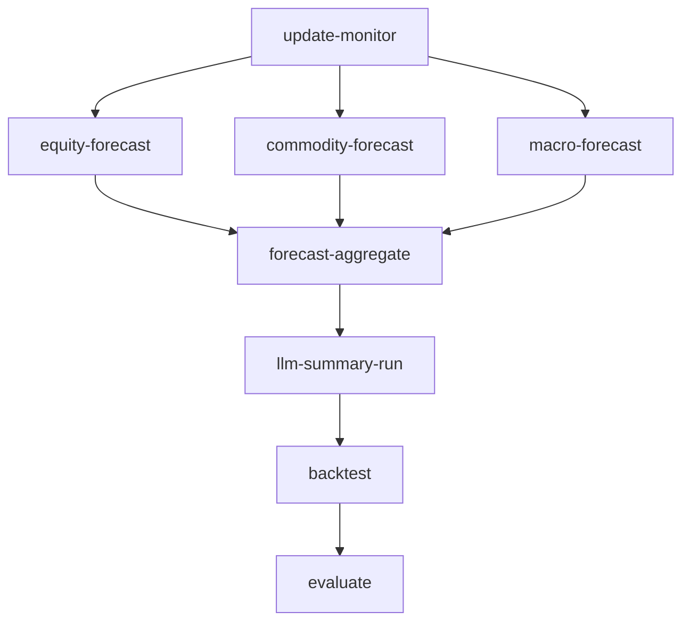

# 🏥 Page Spec — Agents Health Panel

**Page Route**: `/integration_agents_health` → `/agents_health` (production)
**Priority**: 🥉 Haute (RoI = 16.0)
**Status**: 🚧 DEV-only → Production Ready
**Assigné**: Dev Team

---

## 🎯 Objectif UX

Fournir à Reda **monitoring santé système** + **actions manuelles** pour:
1. **Visualiser freshness** agents (badges 🟢/🟡/🔴)
2. **Identifier bloquants** (agents pas run, données périmées)
3. **Déclencher refresh** manuellement (boutons par agent)
4. **Voir logs live** (stdout/stderr agents en cours)
5. **Comprendre dépendances** (DAG pipeline optionnel)

**Persona**: Reda (investisseur, veut autonomie pour refresh si données stale)

**Use Case**: Morning routine → Overview montre données H-48 → clic "Agents Health" → voit agent macro périmé → clic "Relancer macro-forecast" → attend 30s → refresh Overview

---

## 📥 Sources de Données

### 1. Freshness Status
**Partition**: `data/quality/dt=YYYYMMDD/freshness.json`

**Schema JSON**:
```json
{
  "asof": "2025-10-29T14:30:00Z",
  "dt": "20251029",
  "latest": {
    "forecast_dt": "20251029",
    "final_dt": "20251029",
    "macro_forecast_dt": "20251027",
    "news_dt": "20251028",
    "quality_dt": "20251029",
    "llm_summary_dt": "2025102914"
  },
  "checks": {
    "forecasts_today": true,
    "final_today": true,
    "macro_today": false,
    "prices_5y_coverage_ratio": 0.87
  }
}
```

**Loader**: `load_json_latest("data/quality/dt=*/freshness.json")`

**Empty State**: "Aucune donnée de fraîcheur disponible. Agent update-monitor n'a pas été exécuté."

---

### 2. Agent Definitions (Hardcodé)
**Structure**:
```python
AGENTS = [
    {
        "name": "equity-forecast",
        "label": "Forecasts Equity",
        "target": "equity-forecast",
        "freshness_key": "forecast_dt",
        "description": "Génère forecasts momentum pour équities",
        "duration_estimate": "5-10 min"
    },
    {
        "name": "commodity-forecast",
        "label": "Forecasts Commodities",
        "target": "commodity-forecast",
        "freshness_key": "forecast_dt",
        "description": "Génère forecasts pour Gold, Oil, Silver, Copper, Corn",
        "duration_estimate": "2-5 min"
    },
    {
        "name": "macro-forecast",
        "label": "Forecasts Macro",
        "target": "macro-forecast",
        "freshness_key": "macro_forecast_dt",
        "description": "Génère prévisions macro (CPI, unemployment, yields, régime)",
        "duration_estimate": "1-2 min"
    },
    {
        "name": "forecast-aggregate",
        "label": "Agrégation Forecasts",
        "target": "forecast-aggregate",
        "freshness_key": "final_dt",
        "description": "Agrège rule/ML/LLM en final_score",
        "duration_estimate": "30s"
    },
    {
        "name": "llm-summary-run",
        "label": "Synthèse LLM",
        "target": "llm-summary-run",
        "freshness_key": "llm_summary_dt",
        "description": "Arbitre multi-agents LLM (DeepSeek R1)",
        "duration_estimate": "30-60s"
    },
    {
        "name": "update-monitor",
        "label": "Monitor Freshness",
        "target": "update-monitor",
        "freshness_key": "quality_dt",
        "description": "Scan freshness toutes partitions + coverage 5y",
        "duration_estimate": "10s"
    },
    {
        "name": "backtest",
        "label": "Backtest",
        "target": "backtest",
        "freshness_key": None,  # Pas de freshness check (on-demand)
        "description": "Backtest Top-N strategy (equity curve + metrics)",
        "duration_estimate": "2-5 min"
    },
    {
        "name": "evaluate",
        "label": "Evaluation",
        "target": "evaluate",
        "freshness_key": None,
        "description": "Calcule MAE/RMSE/hit_ratio forecasts vs realized",
        "duration_estimate": "1-2 min"
    }
]
```

---

### 3. Locks Status
**Lock Files**: `artifacts/locks/<target>.lock`

**Logique Check**:
```python
def is_locked(target: str, ttl: int = 3600) -> bool:
    lock_path = Path("artifacts/locks") / f"{target}.lock"
    if lock_path.exists():
        age = time.time() - lock_path.stat().st_mtime
        return age < ttl
    return False
```

---

### 4. Logs (optionnel, live)
**Log Files**: `artifacts/logs/{target}.log`

**Lecture**:
```python
def read_logs_tail(target: str, lines: int = 20) -> str:
    log_path = Path("artifacts/logs") / f"{target}.log"
    if log_path.exists():
        with open(log_path) as f:
            return "\n".join(f.readlines()[-lines:])
    return "Aucun log disponible."
```

---

## 🎨 Layout & IDs

### Structure Globale
```python
html.Div([
    html.H2("Santé des Agents", className="mb-4"),

    # Indicateur global
    dbc.Row([
        dbc.Col([
            dbc.Card([
                dbc.CardBody([
                    html.H4("Statut Global", className="mb-3"),
                    dbc.Badge(
                        "Tous agents à jour",  # ou "Agents périmés détectés"
                        id="agents-health-global-badge",
                        color="success",  # ou warning/danger
                        className="fs-5"
                    ),
                    html.P(
                        f"Dernière vérification: {asof_human}",
                        className="text-muted mb-0 mt-2"
                    )
                ])
            ])
        ], md=12)
    ], className="mb-4"),

    # Table agents
    dbc.Row([
        dbc.Col([
            dbc.Card([
                dbc.CardHeader("État des Agents"),
                dbc.CardBody([
                    dbc.Table(
                        id="agents-health-table",
                        # Columns: Badge | Agent | Dernière Exécution | Durée Estimée | Action
                        children=[
                            html.Thead(html.Tr([
                                html.Th("Statut"),
                                html.Th("Agent"),
                                html.Th("Dernière Exécution"),
                                html.Th("Durée Estimée"),
                                html.Th("Action"),
                                html.Th("Logs")
                            ])),
                            html.Tbody(id="agents-health-table-body")
                        ],
                        striped=True,
                        bordered=True,
                        hover=True
                    )
                ])
            ])
        ], md=12)
    ], className="mb-4"),

    # Pipeline DAG (optionnel)
    dbc.Row([
        dbc.Col([
            dbc.Accordion([
                dbc.AccordionItem([
                    html.Div(id="agents-health-dag")
                ], title="Voir Pipeline DAG")
            ], start_collapsed=True)
        ], md=12)
    ], className="mb-4"),

    # Intervals
    dcc.Interval(id="agents-health-refresh-interval", interval=10000),  # 10s refresh table
    dcc.Interval(id="agents-health-logs-interval", interval=4000, disabled=True)  # 4s logs si agent running
])
```

---

### Table Agents (Détail Row)

**Pour chaque agent**:
```python
html.Tr([
    # Colonne 1: Badge statut
    html.Td(
        dbc.Badge(
            "🟢" if age_hours < 24 else "🟡" if age_hours < 48 else "🔴",
            color="success" if age_hours < 24 else "warning" if age_hours < 48 else "danger"
        ),
        id=f"agents-health-badge-{agent_name}"
    ),

    # Colonne 2: Label agent
    html.Td([
        html.Strong(agent_label),
        html.Br(),
        html.Small(agent_description, className="text-muted")
    ]),

    # Colonne 3: Dernière exécution
    html.Td([
        html.Span(f"{latest_dt_human}", id=f"agents-health-dt-{agent_name}"),
        html.Br(),
        html.Small(f"Il y a {age_hours:.0f}h", className="text-muted")
    ]),

    # Colonne 4: Durée estimée
    html.Td(duration_estimate, className="text-muted"),

    # Colonne 5: Action bouton
    html.Td([
        dbc.Button(
            [
                dbc.Spinner(size="sm", id=f"agents-health-spinner-{agent_name}", spinner_style={"display": "none"}),
                html.Span(" Relancer", id=f"agents-health-btn-text-{agent_name}")
            ],
            id=f"agents-health-action-{agent_name}",
            size="sm",
            color="primary",
            disabled=is_locked(agent_target)  # Disabled si lock held
        )
    ]),

    # Colonne 6: Logs toggle
    html.Td([
        dbc.Button(
            "📋",
            id=f"agents-health-logs-toggle-{agent_name}",
            size="sm",
            color="link",
            className="p-0"
        )
    ])
], id=f"agents-health-row-{agent_name}")
```

---

### Logs Collapsible (sous chaque row)

```python
html.Tr([
    html.Td(colspan=6, children=[
        dbc.Collapse([
            html.Pre(
                id=f"agents-health-logs-{agent_name}",
                children="Aucun log récent.",
                style={
                    "maxHeight": "200px",
                    "overflowY": "auto",
                    "backgroundColor": "#1e1e1e",
                    "color": "#d4d4d4",
                    "padding": "10px",
                    "fontSize": "0.8rem",
                    "borderRadius": "4px"
                }
            )
        ], id=f"agents-health-logs-collapse-{agent_name}", is_open=False)
    ])
], style={"display": "none"}, id=f"agents-health-logs-row-{agent_name}")
```

---

## 🔄 Callbacks

### Callback 1: Refresh Table (Interval 10s)
**Inputs**:
- `Input("agents-health-refresh-interval", "n_intervals")`

**Outputs**:
- `Output("agents-health-table-body", "children")`
- `Output("agents-health-global-badge", "children")`
- `Output("agents-health-global-badge", "color")`

**Logique**:
```python
@callback(
    Output("agents-health-table-body", "children"),
    Output("agents-health-global-badge", "children"),
    Output("agents-health-global-badge", "color"),
    Input("agents-health-refresh-interval", "n_intervals")
)
def refresh_agents_table(n):
    freshness = load_json_latest("data/quality/dt=*/freshness.json")
    if not freshness:
        return (
            [html.Tr([html.Td("Aucune donnée freshness.", colspan=6)])],
            "Données indisponibles",
            "secondary"
        )

    rows = []
    stale_count = 0
    now = datetime.utcnow()

    for agent in AGENTS:
        # Get latest dt
        freshness_key = agent["freshness_key"]
        if freshness_key:
            latest_dt_str = freshness["latest"].get(freshness_key)
            if latest_dt_str:
                # Parse dt (YYYYMMDD ou YYYYMMDDHH)
                if len(latest_dt_str) == 8:
                    latest_dt = datetime.strptime(latest_dt_str, "%Y%m%d")
                else:
                    latest_dt = datetime.strptime(latest_dt_str, "%Y%m%d%H")
                age_hours = (now - latest_dt).total_seconds() / 3600
            else:
                age_hours = 999  # Never run
        else:
            age_hours = None  # On-demand agent

        # Badge color
        if age_hours is None:
            badge = "⚪"
            badge_color = "secondary"
        elif age_hours < 24:
            badge = "🟢"
            badge_color = "success"
        elif age_hours < 48:
            badge = "🟡"
            badge_color = "warning"
            stale_count += 1
        else:
            badge = "🔴"
            badge_color = "danger"
            stale_count += 1

        # Check lock
        is_locked_now = is_locked(agent["target"])

        # Build row
        rows.append(
            html.Tr([
                html.Td(dbc.Badge(badge, color=badge_color)),
                html.Td([
                    html.Strong(agent["label"]),
                    html.Br(),
                    html.Small(agent["description"], className="text-muted")
                ]),
                html.Td([
                    html.Span(f"{latest_dt_str if age_hours is not None else 'N/A'}"),
                    html.Br(),
                    html.Small(f"Il y a {age_hours:.0f}h" if age_hours and age_hours < 999 else "Jamais exécuté", className="text-muted")
                ] if age_hours is not None else "N/A"),
                html.Td(agent["duration_estimate"], className="text-muted"),
                html.Td([
                    dbc.Button(
                        [
                            dbc.Spinner(size="sm", spinner_style={"display": "none"}),
                            " Relancer"
                        ],
                        id=f"agents-health-action-{agent['name']}",
                        size="sm",
                        color="primary",
                        disabled=is_locked_now
                    )
                ]),
                html.Td([
                    dbc.Button("📋", id=f"agents-health-logs-toggle-{agent['name']}", size="sm", color="link", className="p-0")
                ])
            ])
        )

    # Global badge
    if stale_count == 0:
        global_badge = "Tous agents à jour"
        global_color = "success"
    elif stale_count <= 2:
        global_badge = f"{stale_count} agent(s) périmé(s)"
        global_color = "warning"
    else:
        global_badge = f"{stale_count} agents périmés"
        global_color = "danger"

    return rows, global_badge, global_color
```

---

### Callback 2: Action Bouton Agent (Pattern Factory)
**Inputs**:
- `Input(f"agents-health-action-{agent_name}", "n_clicks")`

**Outputs**:
- `Output(f"agents-health-action-{agent_name}", "disabled")`
- `Output(f"agents-health-spinner-{agent_name}", "spinner_style")`
- `Output(f"agents-health-logs-{agent_name}", "children")`
- `Output("agents-health-logs-interval", "disabled")`

**Logique** (générer dynamiquement pour chaque agent):
```python
from src.tools.make import run_make
from src.tools.lock import acquire_lock, release_lock

def create_action_callback(agent_name: str, agent_target: str):
    @callback(
        Output(f"agents-health-action-{agent_name}", "disabled"),
        Output(f"agents-health-spinner-{agent_name}", "spinner_style"),
        Output(f"agents-health-logs-{agent_name}", "children"),
        Output("agents-health-logs-interval", "disabled", allow_duplicate=True),
        Input(f"agents-health-action-{agent_name}", "n_clicks"),
        prevent_initial_call=True
    )
    def run_agent_manual(n):
        if not n:
            raise PreventUpdate

        # Check lock
        if not acquire_lock(agent_target, ttl=3600):
            return (
                True,
                {"display": "none"},
                "Un autre processus est déjà en cours. Veuillez patienter.",
                True
            )

        try:
            # Disable button, show spinner
            # Run make target in background (non-blocking)
            result = run_make(agent_target, timeout=900)

            # Success
            if result["returncode"] == 0:
                logs = result["stdout"] or "Exécution réussie."
                color = "success"
            else:
                logs = result["stderr"] or result["stdout"] or "Erreur inconnue."
                color = "danger"

            return (
                False,  # Re-enable button
                {"display": "none"},  # Hide spinner
                logs,
                False  # Enable interval pour refresh logs live
            )
        except Exception as e:
            return (
                False,
                {"display": "none"},
                f"Erreur: {str(e)}",
                True
            )
        finally:
            release_lock(agent_target)

# Register for all agents
for agent in AGENTS:
    create_action_callback(agent["name"], agent["target"])
```

---

### Callback 3: Logs Toggle (Collapsible)
**Inputs**:
- `Input(f"agents-health-logs-toggle-{agent_name}", "n_clicks")`

**Outputs**:
- `Output(f"agents-health-logs-collapse-{agent_name}", "is_open")`

**Logique**:
```python
def create_logs_toggle_callback(agent_name: str):
    @callback(
        Output(f"agents-health-logs-collapse-{agent_name}", "is_open"),
        Input(f"agents-health-logs-toggle-{agent_name}", "n_clicks"),
        State(f"agents-health-logs-collapse-{agent_name}", "is_open"),
        prevent_initial_call=True
    )
    def toggle_logs(n, is_open):
        if n:
            return not is_open
        return is_open

for agent in AGENTS:
    create_logs_toggle_callback(agent["name"])
```

---

### Callback 4: Refresh Logs Live (Interval 4s)
**Inputs**:
- `Input("agents-health-logs-interval", "n_intervals")`

**Outputs**:
- `Output(f"agents-health-logs-{agent_name}", "children")` (pour tous agents avec logs ouverts)

**Logique**:
```python
@callback(
    [Output(f"agents-health-logs-{agent['name']}", "children") for agent in AGENTS],
    Input("agents-health-logs-interval", "n_intervals"),
    prevent_initial_call=True
)
def refresh_logs_live(n):
    if not n:
        raise PreventUpdate

    logs_outputs = []
    for agent in AGENTS:
        # Check if locked (running)
        if is_locked(agent["target"]):
            # Read latest logs
            logs = read_logs_tail(agent["target"], lines=20)
            logs_outputs.append(logs)
        else:
            # Not running, no update
            logs_outputs.append(dash.no_update)

    return logs_outputs
```

---

## 🧪 Tests

### 1. Test Route HTTP 200
**Fichier**: `tests/e2e/test_agents_health_page.py`

```python
def test_agents_health_page_loads(dash_duo):
    """Test page /integration_agents_health charge sans erreurs."""
    dash_duo.start_server(app)
    dash_duo.wait_for_page("/integration_agents_health", timeout=5)
    assert dash_duo.get_logs() == [], "Console errors detected"
```

### 2. Test Table Affichée
```python
def test_agents_health_table_present(dash_duo):
    """Test table agents présente avec N rows."""
    dash_duo.start_server(app)
    dash_duo.wait_for_element("#agents-health-table", timeout=5)
    rows = dash_duo.find_elements("#agents-health-table tbody tr")
    assert len(rows) >= 6, f"Expected at least 6 agent rows, got {len(rows)}"
```

### 3. Test Bouton Action (Mock Make)
```python
def test_agents_health_action_button(dash_duo, monkeypatch):
    """Test bouton 'Relancer' disable/enable + logs."""
    mock_result = {"stdout": "Agent executed successfully", "stderr": "", "returncode": 0}
    monkeypatch.setattr("src.tools.make.run_make", lambda *args, **kwargs: mock_result)

    dash_duo.start_server(app)
    dash_duo.wait_for_element("#agents-health-action-equity-forecast", timeout=5)

    # Click button
    dash_duo.find_element("#agents-health-action-equity-forecast").click()

    # Check disabled during execution (mock instant)
    time.sleep(0.5)

    # Check logs appear
    dash_duo.wait_for_text_to_equal("#agents-health-logs-equity-forecast", "Agent executed successfully", timeout=5)
```

### 4. Test Lock Mechanism
```python
def test_agents_health_lock_prevents_double_click(dash_duo, tmp_path, monkeypatch):
    """Test lock empêche double-clic."""
    # Create fake lock
    lock_path = tmp_path / "artifacts" / "locks" / "equity-forecast.lock"
    lock_path.parent.mkdir(parents=True, exist_ok=True)
    lock_path.write_text(str(time.time()))

    monkeypatch.setattr("src.tools.lock.Path", lambda p: tmp_path / p)

    dash_duo.start_server(app)
    dash_duo.wait_for_element("#agents-health-action-equity-forecast", timeout=5)

    # Button should be disabled
    button = dash_duo.find_element("#agents-health-action-equity-forecast")
    assert button.get_attribute("disabled") == "true", "Button should be disabled when locked"
```

### 5. Test UI Health (Playwright)
```python
def test_agents_health_no_errors():
    """Screenshot Agents Health page, vérifie pas de .alert-danger."""
    page.goto("http://localhost:8050/integration_agents_health")
    page.wait_for_selector("#agents-health-table", timeout=5000)

    # Check no errors
    errors = page.locator(".alert-danger").all()
    assert len(errors) == 0, "Error alerts found"

    # Screenshot
    page.screenshot(path="artifacts/ui_health/agents_health.png")
```

---

## ✅ Définition de Fini (DoD)

- [ ] Page route `/integration_agents_health` accessible HTTP 200
- [ ] Table affiche badges 🟢/🟡/🔴 par agent (≥6 agents)
- [ ] Boutons "Relancer" fonctionnent (disable/enable + logs)
- [ ] Lock mechanism empêche double-clic (TTL 1h)
- [ ] Logs collapsible par agent (toggle 📋)
- [ ] Interval refresh table (10s) fonctionne
- [ ] Interval refresh logs live (4s) si agent running
- [ ] Empty state si freshness.json absent
- [ ] Tests passent (5 tests E2E + 1 unit lock)
- [ ] UI health screenshot sans .alert-danger
- [ ] Retirer gate `DEVTOOLS_ENABLED`
- [ ] Docs mises à jour (engineering_rules, module_index)

---

## 🔧 Modules Réutilisés

- ✅ `src/tools/make.py`: `run_make(target, timeout)`
- ✅ `src/dash_app/data/loader.py`: `load_json_latest()`
- 🆕 `src/tools/lock.py`: `acquire_lock()`, `release_lock()`, `is_locked()` (à créer)

---

## 📊 Améliorations Futures (Post-Sprint 1)

### 1. Pipeline DAG Visual
**Mermaid Diagram**:


**Intégration Dash**:
```python
import dash_mermaid_components as dmc

html.Div([
    dmc.Mermaid(
        chart="""
        graph TD
            A[update-monitor] --> B[equity-forecast]
            ...
        """
    )
], id="agents-health-dag")
```

### 2. Real-time Progress Bar
**WebSocket** pour progress bar (0-100%) pendant exécution agent.

### 3. Agent History Timeline
**Chart Plotly** montrant historique success/failure derniers 7 jours.

### 4. Auto-Retry Failed Agents
**Bouton "Auto-Retry"** qui relance automatiquement tous agents 🔴.

---

## 📚 Références

- **Backlog Idée**: `docs/ideas/10_feature_backlog.md` (Idée #03)
- **ADR Partitions**: `docs/architecture/adr/ADR-001-partitions-et-format.md`
- **Module Make**: `src/tools/make.py`
- **Page Observability**: `src/dash_app/pages/observability.py` (inspiration)

---

**Version**: 1.0
**Next Review**: Après implémentation Sprint 1
